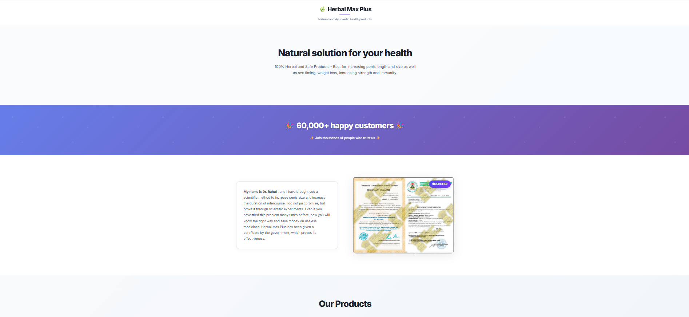
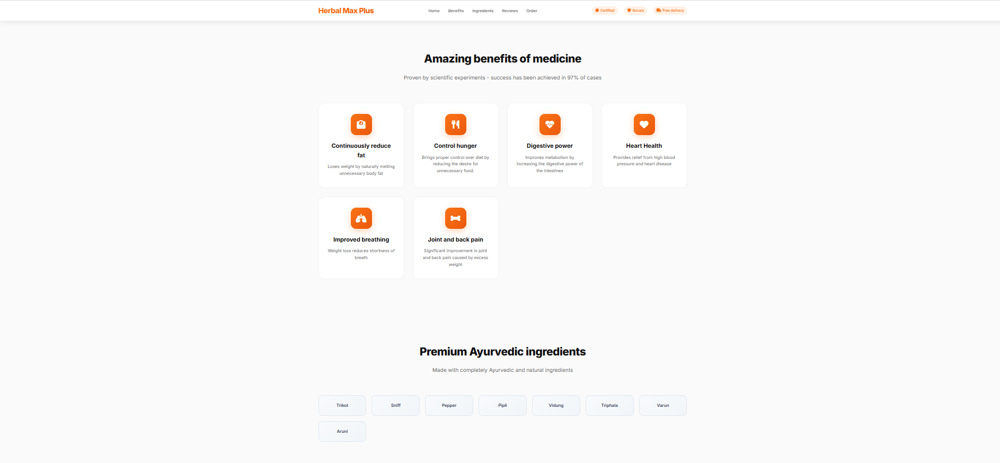
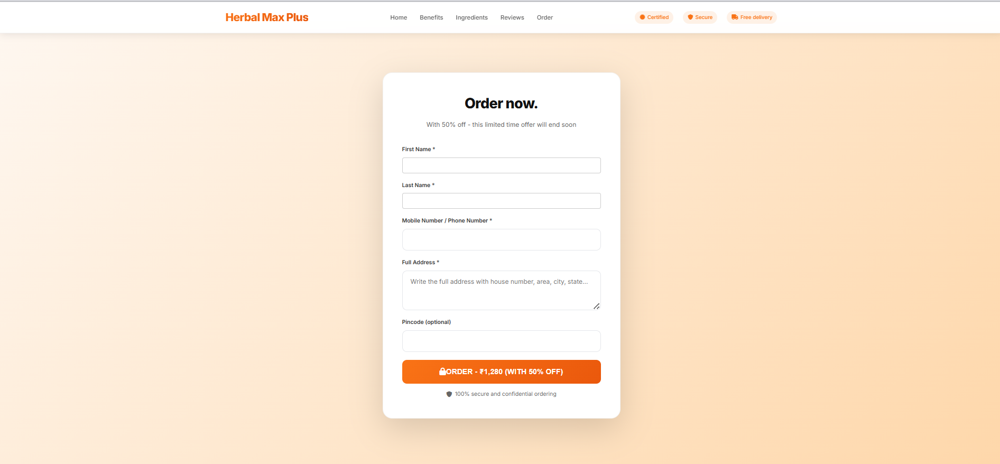
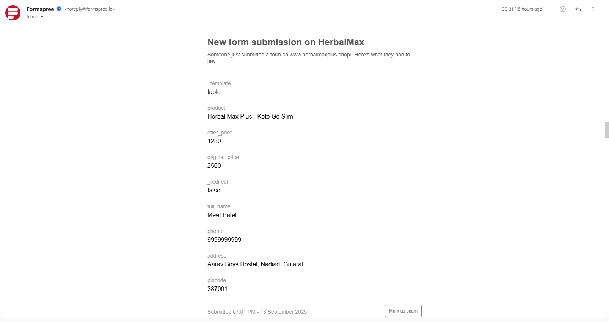
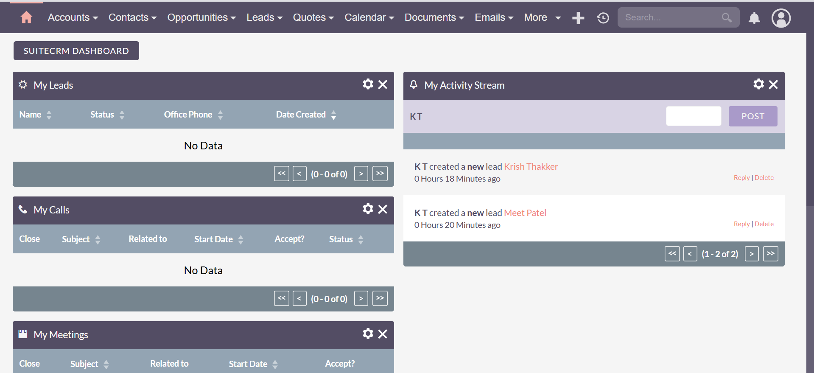
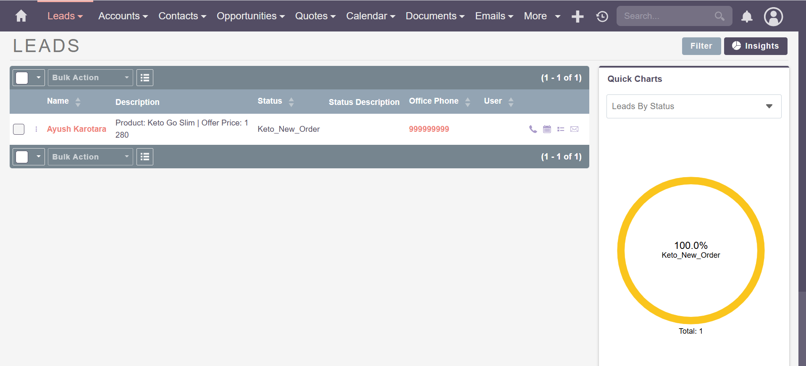

# Herbal Max Plus Website Project

A minimal **Herbal Max Plus** e-commerce landing page that allows customers to place orders via a website. Orders are sent to **Formspree** and simultaneously to a **SuiteCRM instance** for lead management. This project is modular and can be customized for other products.

---

## Table of Contents

1. [Demo](#demo)  
2. [Features](#features)  
3. [Project Structure](#project-structure)  
4. [Installation](#installation)  
5. [Usage](#usage)  
6. [Configuration](#configuration)  
7. [Security Notes](#security-notes)  
8. [Recommended Enhancements](#recommended-enhancements)  
9. [License](#license)  
10. [Screenshots](#screenshots)  

---

## Demo

- **Live frontend demo**: `https://herbalmaxplus.shop`  
- Note: CRM integration requires server with PHP; Formspree works on static hosting.

---

## Features

- Fully responsive landing page in **Gujarati** and **English**.  
- Hero section with **countdown timer** and **image gallery**.  
- Product benefits and ingredients section.  
- Testimonials section for social proof.  
- Order form:
  1. Sends customer data to **Formspree** (email)  
  2. Sends lead to **SuiteCRM** via `lead-proxy.php`  
- Smooth scroll navigation.  
- Animated features and testimonials.  

---

## Project Structure

    HerbalMaxPlus-Website/
    │
    ├── index.html # Main website
    ├── shilajit.css # CSS file
    ├── js/
    │ └── main.js # JS file (image gallery, countdown, form submission)
    ├── img/ # All images (shilajitmain.jpg, thumbnails, favicon)
    ├── backend/
    │ └── lead-proxy.php # CRM proxy script (sensitive, do NOT upload public)
    ├── README.md # Project documentation
    ├── LICENSE # Optional license
    └── .gitignore # Ignore sensitive files


---

## Step 1: Installation

1. **Clone the repository**:

  ```bash
  git clone https://github.com/krishkkt/HerbalMax---An-Simple-Ecommerce-Website.git
  cd HerbalMaxPlus-Website
  ```

  a. Open index.html in your browser for a local preview.
  b. For full CRM integration, upload the project to a server with PHP support (Apache/Nginx).

## Step 2: Usage

  a. Customers can place orders directly on the website.
  b. Orders are submitted via Formspree email and sent to SuiteCRM automatically.
  c. Admin can view leads in SuiteCRM and modify them as needed.

## Step 3: Configuration

3.1 Formspree
  a. Open index.html → <form id="orderForm">
  b. Update the action attribute to your Formspree form URL:

  ```html
    <form id="orderForm" method="POST" action="https://formspree.io/f/yourformid">
  ```

3.2 SuiteCRM Proxy
  a. backend/lead-proxy.php handles sending data to SuiteCRM.
  b. Update the proxy with your SuiteCRM API credentials.
  c. Important: Do not commit lead-proxy.php with credentials to GitHub. Add it to .gitignore.

3.3 PEM / Security Files
  a. If your proxy uses a .pem file (for server connection), do not upload to GitHub.
  b. Keep it locally on your server and reference it in lead-proxy.php.

## Step 4: Security Notes

  a. Keep backend/lead-proxy.php and .pem files private.
  b. Directory permissions for SuiteCRM must allow write access for backups:
      ```bash
          chmod 775 suitecrm/backups
          chown www-data:www-data suitecrm/backups
      ```
  c. Formspree handles email securely; no sensitive info is exposed.

## Step 5: Recommended Enhancements

  a. Separate JS from HTML (main.js) for cleaner structure.
  b. Add .env or config.php for sensitive credentials.
  c. Add analytics (optional).
  d. Add multiple languages if required.

## Step 6: License

  a. This project is for educational/demo purposes. You can modify and use it for your own websites, but do not redistribute sensitive CRM credentials or .pem files.

## Step 7: Screenshots
 ### a. Website Homepage
  
*Main landing page showing product hero section.*

### b. Website Features Section
  
*Benefits and ingredients section of the website.*

### c. Website Order Section
  
*Order form section for customers to place orders.*

### d. Formspree Submission Confirmation
  
*Confirmation page after order submission via Formspree.*

### e. SuiteCRM Lead Dashboard
  
*Dashboard showing all leads generated from website orders.*

### f. SuiteCRM Individual Lead View
  
*Detailed view of a single lead received from the website.*

